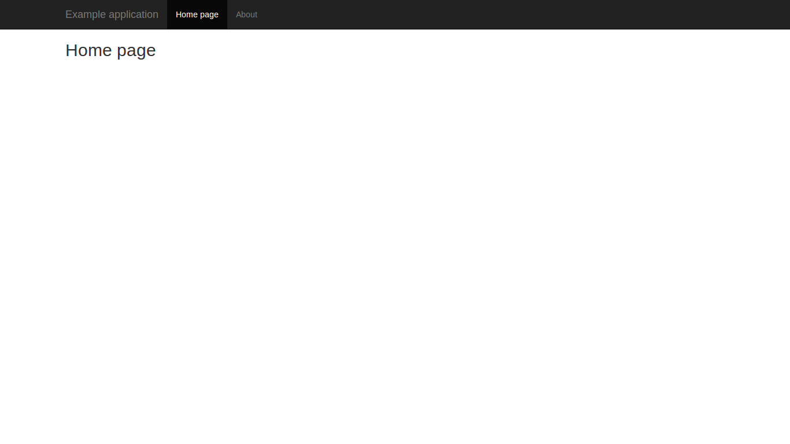
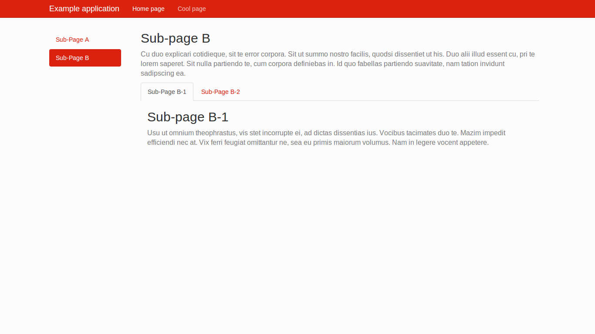

Example Applications
====================

Minimal
-------

<a href="http://generator-minimal.meteor.com" target="_blank" class="btn btn-success">Live example</a> <a href="https://github.com/perak/kitchen-examples/tree/master/example-minimal" target="_blank" class="btn btn-default">Source code</a>

Subpages
--------

<a href="http://generator-subpages.meteor.com" target="_blank" class="btn btn-success">Live example</a> <a href="https://github.com/perak/kitchen-examples/tree/master/example-subpages" target="_blank" class="btn btn-default">Source code</a>

DataView & Forms
----------------

<a href="http://generator-dataview.meteor.com" target="_blank" class="btn btn-success">Live example</a> <a href="https://github.com/perak/kitchen-examples/tree/master/example-dataview" target="_blank" class="btn btn-default">Source code</a>

User Accounts
-------------

<a href="http://generator-accounts.meteor.com" target="_blank" class="btn btn-success">Live example</a> <a href="https://github.com/perak/kitchen-examples/tree/master/example-accounts" target="_blank" class="btn btn-default">Source code</a>

Invoices
--------

<a href="http://generator-invoices.meteor.com" target="_blank" class="btn btn-success">Live example</a> <a href="https://github.com/perak/kitchen-examples/tree/master/example-invoices" target="_blank" class="btn btn-default">Source code</a>

Plugins
-------

<a href="http://generator-plugins.meteor.com" target="_blank" class="btn btn-success">Live example</a> <a href="https://github.com/perak/kitchen-examples/tree/master/example-plugins" target="_blank" class="btn btn-default">Source code</a>
